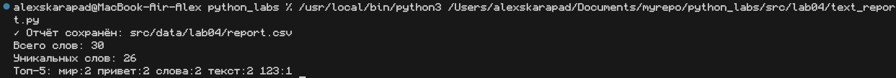

# Лабораторная работа №4
## Архитектура проекта

```
📦 PYTHON_LABS
┣ 📂 misc
┣ 📂 src
┃  ┣ 📂 lab01
┃  ┣ 📂 lab02
┃  ┗ 📂 lab03
┃     ┣ 📜 README.md                    # Отчет по по функциям из ЛР3
┃     ┗ 📜 text_stats.py                # Основная программа анализа текста
┣ 📂 lib                                     
┃  ┣ 📜 text.py                         # Библиотека функций для работы с текстом
┃  ┗ 📂 __pycache__
┣ 📂 data
┃  ┗ 📂 lab04
┃     ┣ 📜 input.txt                   # Тестовый входной файл
┃     ┣ 📜 a.txt                       # Дополнительный тестовый файл
┃     ┣ 📜 b.txt                       # Дополнительный тестовый файл
┃     ┗ 📜 report.csv                  # Пример выходного файла
┣ 📂 images
┃  ┗ 📂 lab04
┃     ┣ 📜 screenshot1.png             # Скриншот работы базовой версии
┃     ┣ 📜 screenshot2.png             # Скриншот работы с аргументами
┃     ┗ 📜 screenshot3.png             # Скриншот структуры файлов
┗ 📜 README.md                         # Общий отчет по ЛР4                       
```

## Заданание A

**Функция №1**

**Описание:** read_text() — мгновенно читает любой текстовый файл в строку. Укажи путь — получи содержимое. Сама разберётся с кодировками и ошибками. Максимум результата — минимум кода.

**Исходный код функции:**
```
def read_text(path: str, encoding: str = "utf-8") -> str:
    return Path(path).read_text(encoding=encoding)
```

**Функция №2**

**Описание:** write_csv() — мгновенно сохраняет данные в CSV. Передай строки и путь — всё остальное сделает сама. Автоматически создаёт папки и формирует файл с правильным форматированием.

**Исходный код функции:**
```
def write_csv(rows: list, path: str, header: tuple = None) -> None:
    Path(path).parent.mkdir(parents=True, exist_ok=True)
    
    with open(path, 'w', newline='', encoding='utf-8') as f:
        w = writer(f)
        if header:
            w.writerow(header)
        w.writerows(rows)
```

## Заданание B

**Описание** Скрипт автоматически анализирует текст: читает файл, подсчитывает частоту слов, сохраняет результат в CSV и выводит ключевую статистику. Готовое решение для текстовой аналитики с обработкой ошибок.

**Исходный код**
```
import sys
from pathlib import Path

sys.path.insert(0, str(Path(__file__).parent.parent))

from lab04.io_txt_csv import read_text, write_csv
from lib.text import normalize, tokenize, count_freq, top_n

def main():
    input_file = "src/data/lab04/input.txt"  
    output_file = "src/data/lab04/report.csv"  
    
    try:
        text = read_text(input_file)
        freq = count_freq(tokenize(normalize(text)))
        write_csv(sorted(freq.items(), key=lambda x: (-x[1], x[0])), 
                 output_file, header=("word", "count"))
        
        print(f"✓ Отчёт сохранён: {output_file}")
        print(f"Всего слов: {sum(freq.values())}")
        print(f"Уникальных слов: {len(freq)}")
        print("Топ-5:", *[f"{w}:{c}" for w, c in top_n(freq, 5)])
        
    except FileNotFoundError:
        print(f"✗ Файл {input_file} не найден")
        sys.exit(1)
    except Exception as e:
        print(f"✗ Ошибка: {e}")
        sys.exit(1)

if __name__ == "__main__":
    main()
```

**Пример использования:**


## Вывод 
В ходе лабораторной работы успешно разработан программный комплекс для автоматизированного анализа текстовой статистики. Реализованы функции чтения текстовых файлов и экспорта данных в CSV-формат, создан основной скрипт, интегрирующий модули предыдущих работ. Система демонстрирует эффективную обработку текста, подсчёт частотности слов и генерацию структурированных отчётов. Архитектура проекта обеспечивает модульность и повторное использование кода. Все компоненты функционируют в соответствии с техническим заданием.