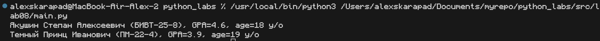
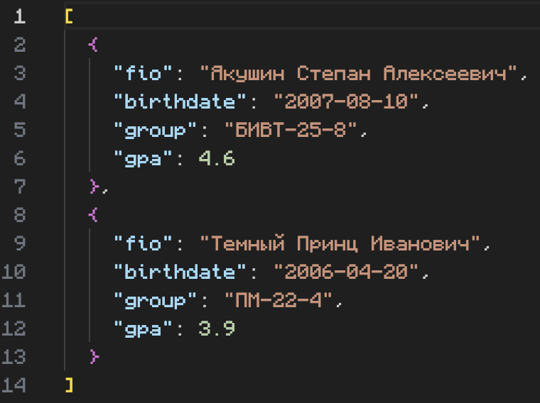

# Лабораторная работа №8
## Архитектура проекта

```
📦 PYTHON_LABS/
├─ 📂 src/
│  └─ 📂 lab_08/
│     └─ 📜 README.md   ← этот отчёт
│     └─ 📜 main.py
│     └─ 📜 models.py
│     └─ 📜 serialize.py
│
└─ 📜 README.md
```

## Задание A

**Оисание:** Данный код реализует класс Student для хранения данных о студенте: ФИО, дату рождения, группу и средний балл (GPA). Класс автоматически проверяет корректность формата даты и значения GPA при создании объекта, предоставляет методы для вычисления возраста, преобразования в словарь и обратно, а также удобного строкового представления.

**Исходный код класса Student:**

```python
@dataclass
class Student:
    fio: str
    birthdate: str   # формат YYYY-MM-DD
    group: str
    gpa: float       # 0..5

    def __post_init__(self):
        # Проверка формата даты
        try:
            datetime.strptime(self.birthdate, "%Y-%m-%d")
        except ValueError:
            raise ValueError(f"Invalid birthdate format: {self.birthdate}. Expected YYYY-MM-DD")

        # Проверка диапазона GPA
        if not (0 <= self.gpa <= 5):
            raise ValueError("GPA must be between 0 and 5")

    def age(self) -> int:
        """Возвращает количество полных лет."""
        bdate = datetime.strptime(self.birthdate, "%Y-%m-%d").date()
        today = date.today()
        years = today.year - bdate.year
        if (today.month, today.day) < (bdate.month, bdate.day):
            years -= 1
        return years

    def to_dict(self) -> dict:
        """Сериализация в словарь."""
        return {
            "fio": self.fio,
            "birthdate": self.birthdate,
            "group": self.group,
            "gpa": self.gpa,
        }

    @classmethod
    def from_dict(cls, data: dict) -> "Student":
        """Создание объекта из словаря."""
        return cls(
            fio=data["fio"],
            birthdate=data["birthdate"],
            group=data["group"],
            gpa=float(data["gpa"]),
        )

    def __str__(self):
        return f"{self.fio} ({self.group}), GPA={self.gpa}, age={self.age()} y/o"
```

## Задание B

**Оисание:**Функция students_to_json сохраняет список объектов Student в JSON-файл, предварительно преобразуя каждый объект в словарь. Функция students_from_json загружает данные из JSON-файла и восстанавливает из них список объектов Student.

**Исходный код Функий:**
```python
def students_to_json(students, path):
    """Сохраняет список студентов в JSON-файл."""
    data = [s.to_dict() for s in students]
    with open(path, "w", encoding="utf-8") as f:
        json.dump(data, f, ensure_ascii=False, indent=2)


def students_from_json(path):
    """Загружает список студентов из JSON-файла."""
    with open(path, "r", encoding="utf-8") as f:
        raw = json.load(f)
    return [Student.from_dict(item) for item in raw]
```

### Запуск ```main.py``` 


### Файл ```student_output.json```



**Вывод:** В ходе лабораторной работы я научился создавать и использовать классы в Python для моделирования реальных сущностей, автоматизировать рутину с помощью ```@dataclass```, проверять корректность данных при создании объекта, а также сохранять и загружать коллекции объектов в формат JSON для долговременного хранения и обмена данными.

