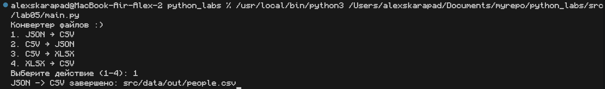
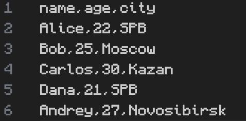
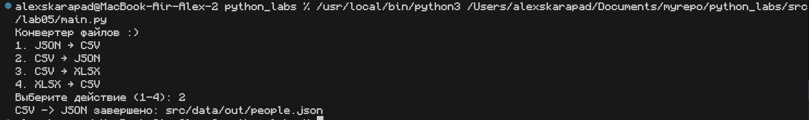
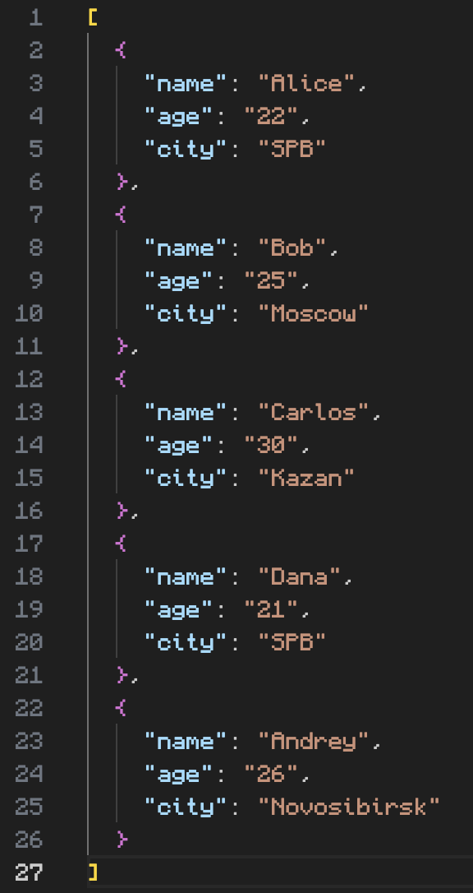
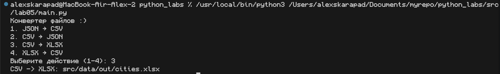
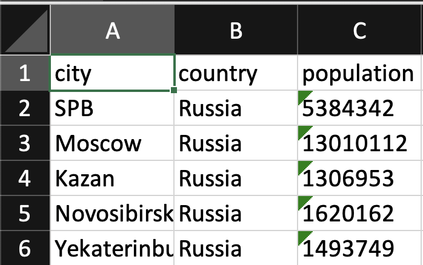
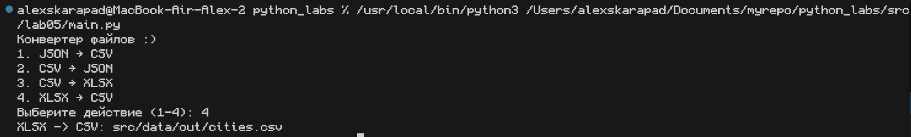
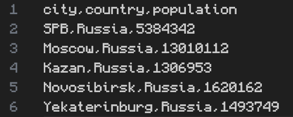

# Лабораторная работа №5
## Архитектура проекта

```
📦 PYTHON_LABS
┣ 📂 data
┃  ┗ 📂 lab05
┃     ┣ 📂 out                         # Выходные файлы
┃     ┃  ┣ 📜 cities.csv
┃     ┃  ┣ 📜 cities.xlsx
┃     ┃  ┣ 📜 people.csv
┃     ┃  ┗ 📜 people.json
┃     ┗ 📂 samples                     # Примеры файлов
┃        ┣ 📜 cities.csv
┃        ┣ 📜 cities.xlsx
┃        ┣ 📜 people.csv
┃        ┗ 📜 people.json
┣ 📂 src
┃  ┗ 📂 lab05
┃     ┣ 📜 json_csv.py                 # Преобразование CSV ↔ Json
┃     ┣ 📜 csv_xlsx.py                 # Преобразование CSV ↔ Excel
┃     ┗ 📜 main.py                     # Основной файл для запуска               
┣ 📜 .gitignore                        
┣ 📜 requirements.txt.                 
┗ 📜 README.md                         # Зависимости проекта (openpyxl)
```

## Задание A

**Функция №1**

**Описание:** Проверяет соответствие расширения файла заданному формату. Вызывает ValueError, если расширение не совпадает.

**Исходный код функции:**
```
def validate_extension(path, ext):
    if not path.lower().endswith(ext.lower()):
        raise ValueError(f"Неверный формат: {path}. Ожидается {ext}")
```

**Функция №2**

**Описание:** Преобразует JSON-файл в CSV-формат. Читает JSON-данные и записывает их в CSV-файл с сохранением структуры.

**Исходный код функции:**
```
def json_to_csv(json_path, csv_path):
    validate_extension(json_path, '.json')
    validate_extension(csv_path, '.csv')
    if not os.path.exists(json_path): raise FileNotFoundError(f"JSON не найден: {json_path}")
    
    with open(json_path, 'r', encoding='utf-8') as f:
        data = json.load(f)
        if not data: raise ValueError("JSON файл пуст")
    
    os.makedirs(os.path.dirname(csv_path), exist_ok=True)
    
    with open(csv_path, 'w', newline='', encoding='utf-8') as f:
        writer = csv.DictWriter(f, fieldnames=list(data[0].keys()))
        writer.writeheader()
        writer.writerows(data)
    
    print(f"JSON -> CSV завершено: {csv_path}")
```

**Функция №3**

**Описание:** Преобразует CSV-файл в JSON-формат. Читает CSV-данные с заголовками и сохраняет их как список словарей в JSON.

**Исходный код функции:**
```
def csv_to_json(csv_path, json_path):
    validate_extension(csv_path, '.csv')
    validate_extension(json_path, '.json')
    if not os.path.exists(csv_path): raise FileNotFoundError(f"CSV не найден: {csv_path}")
    
    with open(csv_path, 'r', encoding='utf-8') as f:
        data = list(csv.DictReader(f))
        if not data: raise ValueError("CSV файл пуст")
    
    os.makedirs(os.path.dirname(json_path), exist_ok=True)
    
    with open(json_path, 'w', encoding='utf-8') as f:
        json.dump(data, f, indent=2, ensure_ascii=False)
    
    print(f"CSV -> JSON завершено: {json_path}")
```


## Задание B

**Функция №1**

**Описание** Преобразует CSV-файл в Excel-формат (.xlsx). Читает данные из CSV и создает Excel-файл с сохранением структуры таблицы.

**Исходный код функции:**
```
def csv_to_xlsx(csv_path, xlsx_path):
    validate_extension(csv_path, '.csv')
    validate_extension(xlsx_path, '.xlsx')
    if not os.path.exists(csv_path): raise FileNotFoundError(f"CSV не найден: {csv_path}")
    
    with open(csv_path, 'r', encoding='utf-8') as f:
        data = list(csv.reader(f))
        if not data: raise ValueError("CSV файл пуст")
    
    wb = openpyxl.Workbook()
    ws = wb.active
    for row_idx, row in enumerate(data, 1):
        for col_idx, value in enumerate(row, 1):
            ws.cell(row=row_idx, column=col_idx, value=value)
    
    os.makedirs(os.path.dirname(xlsx_path), exist_ok=True)
    wb.save(xlsx_path)
    print(f"CSV -> XLSX: {xlsx_path}")
```

**Функция №2** *

**Описание** Преобразует Excel-файл (.xlsx) в CSV-формат. Читает данные с активного листа Excel и сохраняет их в виде таблицы CSV.

**Исходный код функции:**
```
def xlsx_to_csv(xlsx_path, csv_path):
    validate_extension(xlsx_path, '.xlsx')
    validate_extension(csv_path, '.csv')
    if not os.path.exists(xlsx_path): raise FileNotFoundError(f"XLSX не найден: {xlsx_path}")
    
    wb = openpyxl.load_workbook(xlsx_path)
    ws = wb.active
    if ws.max_row == 0 or ws.max_column == 0: raise ValueError("XLSX файл пуст")
    
    os.makedirs(os.path.dirname(csv_path), exist_ok=True)
    with open(csv_path, 'w', newline='', encoding='utf-8') as f:
        csv.writer(f).writerows([cell if cell is not None else '' for cell in row] for row in ws.iter_rows(values_only=True) if any(cell is not None for cell in row))
    
    print(f"XLSX -> CSV: {csv_path}")
```

## Описание скрипта:
**Назначение:** Консольное приложение для преобразования файлов между различными форматами данных. Предоставляет пользователю интуитивно понятный интерфейс для выбора операции конвертации.

**Функциональность:**
* Преобразование JSON ↔ CSV
* Преобразование CSV ↔ Excel (XLSX)
* Валидация входных параметров
* Обработка ошибок и исключительных ситуаций

**Исходный код**
```
from json_csv import json_to_csv, csv_to_json
from csv_xlsx import csv_to_xlsx, xlsx_to_csv
import os

def validate_conversion(input_path, output_path):
    if os.path.abspath(input_path) == os.path.abspath(output_path):
        raise ValueError("❌ Нельзя конвертировать файл в самого себя!")
    
    input_ext = os.path.splitext(input_path)[1].lower()
    output_ext = os.path.splitext(output_path)[1].lower()
    
    if input_ext == output_ext:
        raise ValueError(f"❌ Нельзя конвертировать {input_ext} в {output_ext} - одинаковые форматы!")
def main():
    print("Конвертер файлов :)")
    print("1. JSON → CSV")
    print("2. CSV → JSON") 
    print("3. CSV → XLSX")
    print("4. XLSX → CSV")
    
    choice = input("Выберите действие (1-4): ").strip()
    
    base_path = 'src/data/samples/'
    out_path = 'src/data/out/'
    
    try:
        if choice == '1':
            input_file = base_path + 'people.json'
            output_file = out_path + 'people.csv'
            validate_conversion(input_file, output_file)
            json_to_csv(input_file, output_file)
            
        elif choice == '2':
            input_file = base_path + 'people.csv'
            output_file = out_path + 'people.json'
            validate_conversion(input_file, output_file)
            csv_to_json(input_file, output_file)
            
        elif choice == '3':
            input_file = base_path + 'cities.csv'
            output_file = out_path + 'cities.xlsx'
            validate_conversion(input_file, output_file)
            csv_to_xlsx(input_file, output_file)
            
        elif choice == '4':
            input_file = base_path + 'cities.xlsx'
            output_file = out_path + 'cities.csv'
            validate_conversion(input_file, output_file)
            xlsx_to_csv(input_file, output_file)
            
        else:
            print("❌ Неверный выбор! Введите цифру от 1 до 4")
            
    except (FileNotFoundError, ValueError) as e:
        print(f"❌ Ошибка: {e} :()")

if __name__ == "__main__":
    main()
```

<style>
.small-img { width: 200px; height: auto; }
.medium-img { width: 400px; height: auto; }
</style>

**Пример использования:**

При вводе в консоль "1" Преобразование JSON ↔ CSV

**Вывод консоли:**


**Полученный файл**




При вводе в консоль "2" Преобразование CSV ↔ JSON

**Вывод консоли:**


**Полученный файл**



При вводе в консоль "3" Преобразование CSV ↔ Excel

**Вывод консоли:**


**Полученный файл**




При вводе в консоль "4" Преобразование Excel ↔ CSV

**Вывод консоли:**


**Полученный файл**




## Вывод 
В ходе лабораторной работы успешно разработан программный комплекс для автоматизированного анализа текстовой статистики. Реализованы функции чтения текстовых файлов и экспорта данных в CSV-формат, создан основной скрипт, интегрирующий модули предыдущих работ. Система демонстрирует эффективную обработку текста, подсчёт частотности слов и генерацию структурированных отчётов. Архитектура проекта обеспечивает модульность и повторное использование кода. Все компоненты функционируют в соответствии с техническим заданием.
