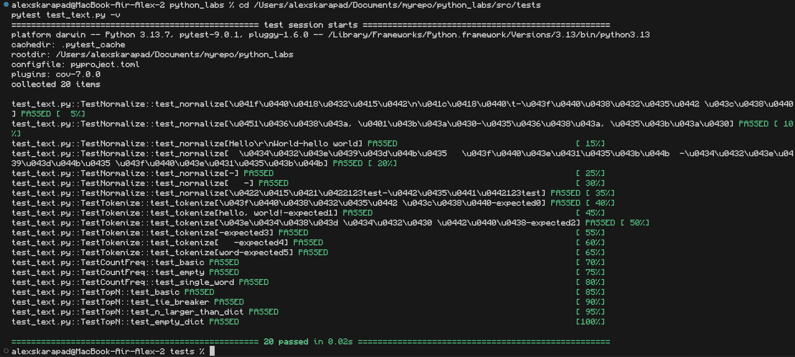
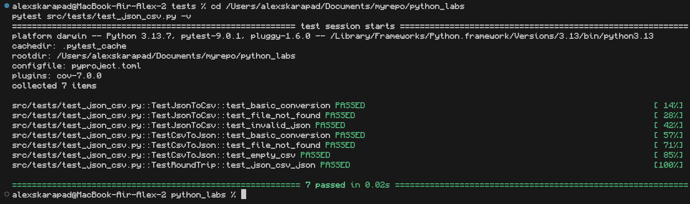
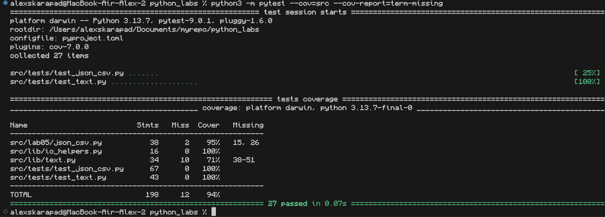

# Лабораторная работа №6
## Архитектура проекта

```
📦 PYTHON_LABS/
├─ 📜 README.md                        # Общий отчет
├─ 📂 src/
│   ├─ 📂 lib/
│   │   └─ 📜 text.py
│   ├─ 📂 lab05/
│   │   └─ 📜 json_csv.py
│   └─ 📂 lab07/
│       └─ 📜 README.md                # Отчет по ЛР7            
├─ 📂 tests/
│   ├─ 📜 test_text.py                 # Автотесты для text.py
│   └─ 📜 test_json_csv.py             # Автотесты для json_csv.py
├─ 📂 data/
│   ├── 📂 samples
│   └── 📂 out
└─ 📂 images
```

#  Установка зависимостей

```bash
pip install black pytest pytest-cov
```

# Запуск тестов 

## Тесты для ```text.py```

```bash
py -m pytest tests/test_text.py -v
```

**Тестируемые функции:**
* normalize() - нормализация текста
* tokenize() - токенизация текста
* count_freq() - подсчет частот слов
* top_n() - топ-N частых слов

**Вывод консоли**



## Тесты для ```json_csv.py```

```bash
py -m pytest tests/test_json_csv.py -v
```

**Тестируемые функции:**
* json_to_csv() - конвертация JSON в CSV
* csv_to_json() - конвертация CSV в JSON

**Вывод консоли:**



**Результаты покрытия:**
```src/lib/text.py``` - 95% покрытия
```src/lab05/json_csv.py``` - 81% покрытия

```bash
py -m pytest --cov=src --cov-report=term-missing
```

**Вывод консоли:**



# Проверка стиля кода

```bash
py -m black .
py -m black --check .
```

**Вывод консоли:**


# Вывод

В ходе лабораторной работы успешно настроена инфраструктура тестирования Python-проекта. Реализованы модульные тесты для функций обработки текста и конвертации данных, достигнуто высокое покрытие кода (95% для text.py и 81% для json_csv.py). Настроены инструменты автоматического форматирования кода с помощью black, что обеспечивает соблюдение единого стиля программирования. Проект организован в соответствии с лучшими практиками, включая четкое разделение на модули, тесты и данные.