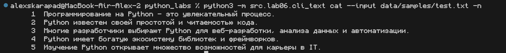
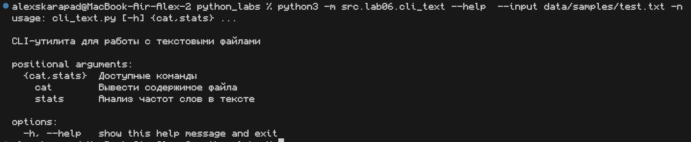
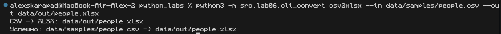
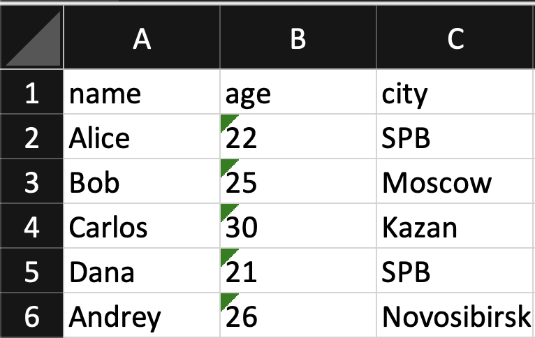
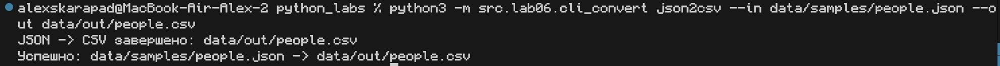
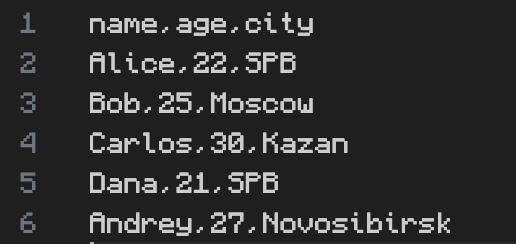
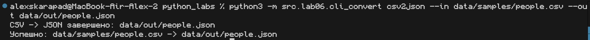
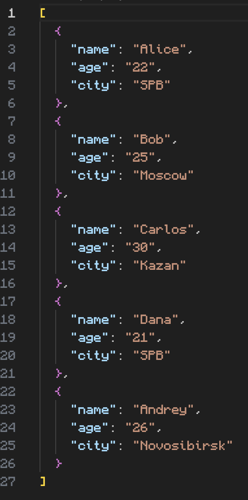

# Лабораторная работа №6
## Архитектура проекта

```
📦 PYTHON_LABS
┣ 📂 data
┃  ┗ 📂 lab05
┃     ┗ 📂 samples                        
┃        ┗ 📜 test.txt                    # тестовый текст
┣ 📂 src
┃  ┗ 📂 lab06
┃     ┣ 📜 cli_text.py                    # модуль работы с текстом
┃     ┗ 📜 cli_convert.py                 # модуль конвертации данных           
┣ 📜 .gitignore                        
┣ 📜 requirements.txt.                 
┗ 📜 README.md                         
```

## Модуль cli_text.py - работа с текстом
**Команда: stats**

**Описание:** Анализ частот слов в текстовом файле

```bash
python3 -m src.lab06.cli_text stats --input data/samples/test.txt
```

**Вывод консоли**


**Команда: cat**

**Описание:** Вывод содержимого файла с опциональной нумерацией

```bash
python3 -m src.lab06.cli_text cat --input data/samples/test.txt -n
```

**Вывод консоли**


**Команда: --help**

**Описание:** Помошник по работе с командой

```bash
python3 -m src.lab06.cli_text --help --input data/samples/test.txt -n
```

**Вывод консоли**


## Модуль cli_convert.py - работа с текстом

**Команда: csv2xlsx**

**Описание:** Конвертирует CSV файл в XLSX формат (Excel)

```bash
python3 -m src.lab06.cli_convert csv2xlsx --in data/samples/people.csv --out data/out/people.xlsx
```

**Вывод консоли**



**Выходной Файл**


**Команда: json2csv**

**Описание:** Конвертирует JSON файл в CSV формат

```bash
python3 -m src.lab06.cli_convert json2csv --in data/samples/people.json --out data/out/people.csv
```

**Вывод консоли**


**Выходной Файл**


**Команда: csv2json**

**Описание:** ККонвертирует CSV файл в JSON формат

```bash
python3 -m src.lab06.cli_convert csv2json --in data/samples/people.csv --out data/out/people.json
```

**Вывод консоли**


**Выходной Файл**


**Вывод:** В ходе работы были успешно реализованы два CLI-модуля для обработки текстовых данных и конвертации форматов файлов.

