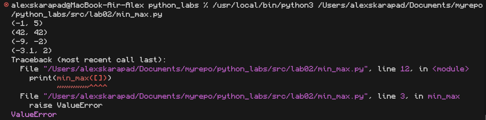
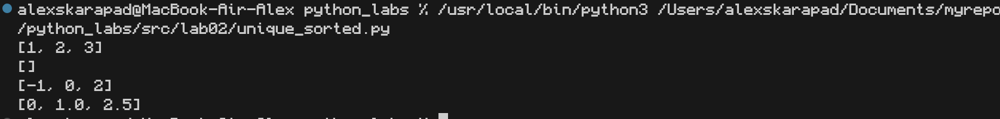
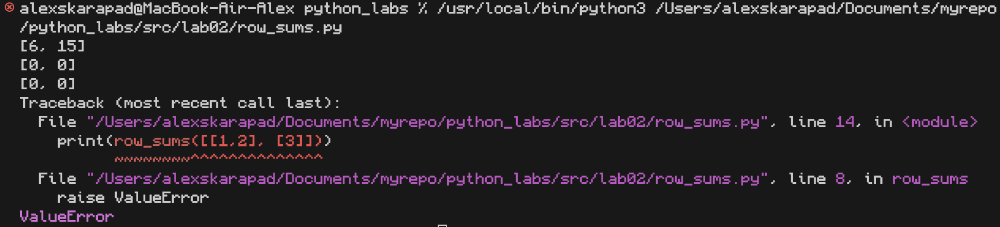
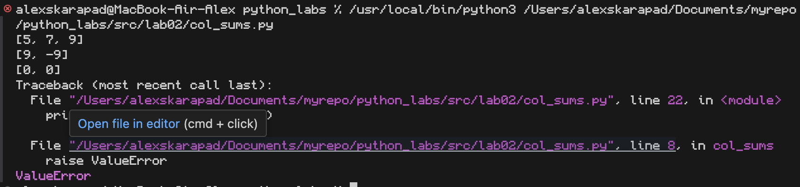

# Лабораторная работа №2

## Задание №1 

### Функция №1

**Описание:** Функция находит минимальный и максимальный элементы в списке и возвращает их в виде кортежа.

**Исходный код функции:**
```
def min_max(nums: list[float | int]):
    if not nums:
        raise Value Error 
    else:
        min_val = min(nums)
        max_val = max(nums)
        return (min_val,max_val)
print(min_max([3, -1, 5, 5, 0]))
print(min_max([42]))
print(min_max([-5, -2, -9]))
print(min_max([1.5,2,2.0,-3.1]))
print(min_max([]))
```
**Пример использования:**


### Функция №2

**Описание:** Функция принимает список чисел, удаляет дубликаты и возвращает отсортированный список уникальных элементов.

**Исходный код функции:**
```
def unique_sorted(nums: list[float | int]):
    return (list(sorted(set(nums))))
print(unique_sorted([3, 1, 2, 1, 3]))
print(unique_sorted([]))
print(unique_sorted([-1, -1, 0, 2, 2]))
print(unique_sorted([1.0, 1, 2.5, 2.5, 0]))
```
**Пример использования:**


### Функция №3

**Описание:** Функция принимает двухмерный массив, проверяет что все элементы являются числами, и возвращает "плоский" одномерный список всех элементов.

**Исходный код функции:**
```
def flatten(mat: list[list | tuple]):
    flattened_list = []
    for row in mat:
        if isinstance(row, (list, tuple)):
            flattened_list.extend(row)
        else:
            raise Value Error 
    return (flattened_list)
print(flatten([[1, 2], [3, 4]]))
print(flatten([[1, 2], (3, 4, 5)]))
print(flatten([[1], [],[2, 3]]))
print(flatten([[1, 2], "ab"]))
```
**Пример использования:**


## Задание №2 

### Функция №1

**Описание:** Функция принимает матрицу (список списков) и возвращает список сумм элементов каждой строки. Проверяет, что матрица прямоугольная.

**Исходный код функции:**
```
def row_sums(mat: list[list[float | int]]):
    if not mat:
        return []    
    rows = len(mat)
    cols = len(mat[0])

    for row in mat:
        if len(row) != cols:
            raise Value Error         
    sums = []
    for row in mat:          
        total = sum(row)      
        sums.append(total)    
    return sums
print(row_sums([[1,2,3], [4,5,6]]))
print(row_sums([[-1, 1], [10, -10]]))
print(row_sums([[0,0], [0,0]]))
print(row_sums([[1,2], [3]]))
```

**Пример использования:**


### Функция №2

**Описание:** Функция выполняет транспонирование матрицы - преобразует строки в столбцы и наоборот.

**Исходный код функции:**
```
def col_sums(mat: list[list[float | int]]):
    if not mat:
        return []
    rows = len(mat)
    cols = len(mat[0])
    for row in mat:
        if len(row) != cols:
            raise Value Error 
    
    sums = []
    for j in range(cols):
        column_sum = 0
        for i in range(rows):
            column_sum += mat[i][j]
        sums.append(column_sum)
    
    return sums

print(col_sums([[1, 2, 3], [4, 5, 6]]))  
print(col_sums([[-1, 1], [10, -10]]))    
print(col_sums([[0, 0], [0, 0]]))        
print(col_sums([[1, 2], [3]])) 
```
**Пример использования:**



### Функция №3

**Описание:** Функция вычисляет суммы элементов каждого столбца матрицы и возвращает их в виде списка.

**Исходный код функции:**
```
def col_sums(mat: list[list[float | int]]):
    if not mat:
        return []
    rows = len(mat)
    cols = len(mat[0])
    for row in mat:
        if len(row) != cols:
            raise Value Error     
    sums = []
    for j in range(cols):
        column_sum = 0
        for i in range(rows):
            column_sum += mat[i][j]
        sums.append(column_sum)    
    return sums

print(col_sums([[1, 2, 3], [4, 5, 6]]))  
print(col_sums([[-1, 1], [10, -10]]))    
print(col_sums([[0, 0], [0, 0]]))        
print(col_sums([[1, 2], [3]]))  
```
**Пример использования:**


## Задание №3

**Описание:** Функция форматирует запись о студенте, преобразуя ФИО в формат "Фамилия И.О.", добавляет группу и округляет GPA до двух знаков.

**Исходный код функции:**
```
def format_record(rec: tuple[str, str, float]):
    fio, group, gpa = rec
    parts = fio.strip().split()
    family = parts[0]
    initials = ""
    for part in parts[1:]:
        initials += part[0].upper() + "."
    if not initials:
        initials = ""
    form_gpa=f"{gpa:.2f}"
    return f"{family} {initials}, гр. {group}, GPA {form_gpa}"
print(format_record(("Иванов Иван Иванович", "BIVT-25", 4.6)))
print(format_record(("Петров Пётр", "IKBO-12", 5.0)))
print(format_record(("Петров Пётр Петрович", "IKBO-12", 5.0)))
print(format_record(("Петров Пётр Петрович", "IKBO-12", 5.0)))
print(format_record(("  сидорова  анна   сергеевна ", "ABB-01", 3.999)))
```

**Пример использования:**


## Вывод:
**Все функции работают с обработкой данных: находят мин/макс, удаляют дубликаты, суммируют строки и столбцы матриц, транспонируют матрицы и форматируют текст. Код рабочий, но лучше возвращать нормальные ошибки через raise вместо строк "ValueError". В целом - полезные утилиты для работы со структурированными данными.**


